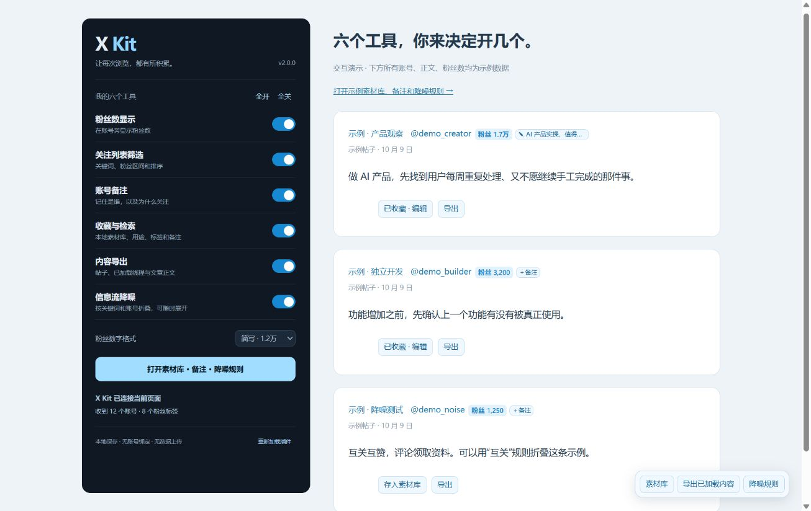

# X Kit

**六个工具，你来决定开几个。**

X Kit 是一个本地优先的 Chrome / Edge 扩展，把刷 X 时常用的六件事放在一起：看粉丝数、筛选账号、做备注、存素材、导出正文、减少噪音。每项都有独立滑动开关，也可以一键全开或全关。



> 上图使用明确标注的示例账号和示例内容。X Kit 不是 X 官方产品。

## 六项功能

| 模块 | 能做什么 | 范围 |
| --- | --- | --- |
| 粉丝数显示 | 在用户名旁显示粉丝数，支持简写与完整数字 | 来自 X 已有响应，不主动请求账号数据 |
| 关注列表筛选 | 关键词、粉丝上下限、升降序、未知数据选项 | 仅本次已浏览账号，不是完整名单 |
| 账号备注 | 记录这个人是谁、为什么值得看 | 按用户名本地保存；改名后需手动迁移 |
| 收藏与检索 | 保存帖子或已识别文章，添加用途、标签、私人备注，全文搜索 | 独立素材库，不自动同步或修改 X 书签 |
| 内容导出 | 单帖、多选当前已加载帖子、已识别文章正文，导出 Markdown 或复制 | 不是自动抓取完整线程；图片保留来源链接，视频回原帖查看 |
| 信息流降噪 | 关键词、账号规则、白名单；匹配后折叠，可展开 | 只改变本机页面，不拉黑或取关 |

## 安装

1. 下载本仓库 ZIP 并解压，或使用发布版安装 ZIP。
2. Chrome 打开 `chrome://extensions`；Edge 打开 `edge://extensions`。
3. 开启「开发者模式」，点击「加载已解压的扩展程序」。
4. 选择直接包含 `manifest.json` 的 **extension** 文件夹。发布版 ZIP 解压后可直接选择其根文件夹。
5. 回到 X，刷新页面。点击工具栏 X Kit 图标，选择需要的功能。

要求 Chrome 114+ 或兼容的 Edge。普通用户无需 Node.js、API Key、付费 API 或另一个账号。没有发布到 Chrome 网上应用店。

**更新：**替换插件文件后，在插件小窗点击「重新加载插件」，再刷新具体 X 标签页。小窗会核对页面实际运行脚本的版本，而不只显示安装文件的版本。

## 快速使用

- 在关注或粉丝列表顶部，用 `AI` + 最低粉丝数 `1万` 筛选。继续向下滚动原列表可以增加收录范围。
- 点击账号旁「＋备注」，记录关注理由。关闭备注功能只隐藏入口和标记，不删除笔记。
- 点击帖子下方「存入素材库」，补上用途（例如选题、案例、工具、待验证）、标签和自己的判断。
- 在素材库搜索正文、作者、标签和备注，按用途筛选；可编辑或导出当前筛选结果。
- 导出线程前，先展开正文并滚动加载。点击「导出已加载内容」，勾选需要的帖子；导出会明确标注局部范围。
- 在素材库的「降噪规则」里每行输入一条关键词或 @账号。白名单优先。空规则不会折叠任何帖子。

六项功能默认开启，降噪规则默认为空。全关后不再显示页面工具；收藏和备注仍可在管理页查看、备份。关闭收藏或备注时禁止新增/修改，数据不会丢失。导出开关控制 Markdown/正文导出，JSON 备份始终可用。

## 数据与边界

- 所有设置、手动收藏、备注只保存在当前浏览器。没有后台服务器、统计埋点或数据上传。
- 卸载插件会删除扩展本地数据，请先导出 JSON 备份。导入采取「合并并保留已有记录」，不覆盖已有条目。
- 素材库最多 1,500 条，写入总量约 8 MB；达到上限会提示，不静默丢弃内容。
- 粉丝缓存最多 4,000 个账号，30 分钟到期；列表收录在刷新、离开或切换列表时清空。
- X 的页面结构和字段可能变化。缺少数据时显示未知；长帖或文章尚未展开/加载时，保存的内容也可能不完整。
- 文章正文识别仍依赖 X 当前页面结构。优先保证已加载文字和来源链接；不宣称保留所有富文本、视频或完整线程。

详见 [隐私说明](PRIVACY.md)。本扩展只请求 `storage` API 权限，页面脚本范围为 x.com 和 twitter.com。

## 开发与验证

```sh
npm ci --ignore-scripts
npm test
```

安装目录已经构建好。修改 `src/` 后运行 `node build.cjs`。测试覆盖开关独立性、名单隔离、存储写入、保存去重、备份合并、导出范围、降噪白名单和恢复行为。浏览器示例运行 `node preview/serve.cjs`，打开 `http://127.0.0.1:8791/preview/toolkit.html`。

请参阅 [贡献指南](CONTRIBUTING.md)、[更新记录](CHANGELOG.md)。代码采用 [MIT License](LICENSE)。

---

## English

**Six tools. You choose which ones stay on.**

X Kit is a local-first Chrome/Edge extension for X: follower badges, loaded-list filtering, account notes, a searchable local clipping library, Markdown exports, and reversible noise filtering. Each feature has its own sliding switch. There is no backend, telemetry, API key or account signup.

Download this repository, open `chrome://extensions`, enable Developer mode, and load the `extension/` folder. Requires Chrome 114+ or a compatible Edge release. After an update, reload the extension and then refresh the X tab.

Saved posts support categories, tags and private notes, full-text search, Markdown export, and JSON backup/merge import. This is a separate local library, not a sync of native X bookmarks. Switching a module off keeps its saved data. Uninstalling removes browser extension storage; back up first.

Filtering covers accounts rendered during the current visit, not a complete follower list. Exports cover selected, already-loaded posts or detected article text, not an automatically fetched complete thread. Image URLs are preserved; video playback remains at the source. Noise rules fold posts locally and never block or unfollow anyone. Account notes are keyed by handle; rename migration is manual.

Development: Node.js 22+, `npm ci --ignore-scripts`, then `npm test`. This runs the build and test suite. See [CONTRIBUTING.md](CONTRIBUTING.md) for release checks. Demo screenshots contain synthetic data. MIT licensed. Not affiliated with X Corp.
